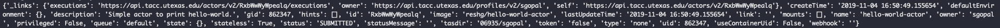
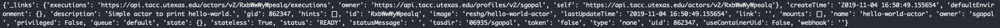
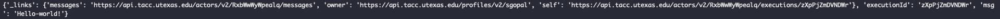
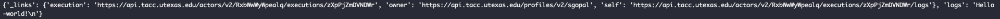

# Abaco

## Requirements

1. TACC Account: https://portal.tacc.utexas.edu/account-request
2. Create a Docker account: https://hub.docker.com/
3. Install the TACC Cloud Python SDK

## Getting Started

With the requirements in place, you are now ready to get started. 

* We need to create an OAuth Client:

  ```
  from agavepy.agave import Agave
  ag = Agave(api_server='https://api.tacc.utexas.edu',
  ...            username='your username',
  ...            password='your password')
  ag.clients.create(body={'clientName': 'enter a client name'})
  ```

  Save your consumerKey and consumerSecret. The OAuth client keys can be reused as well. 

* Once we have this in place, generate a Token: 

  ```
  ag.token.create()
  ```
  Grab the token generated and store it. 

  Running ` ag.profiles.get() ` would show the current user's profile. 


## Exercise: Deploy and test a hello-world container with Abaco

  Let's begin with a simple example of printing "hello-world" using an Abaco Actor. 

  For this example, create a new local directory to hold your work.

* A Basic Python File hello-world.py with a function to print the message (e.g: hello-world! )  sent to the actor when run. 

  ```
  # hello-world.py

  from agavepy.actors import get_context

  # function to print the message
  def say_hello(message):
	    print(message)

  def main():
      context = get_context()
	    message = context['raw_message']
	    say_hello(message)

  if __name__ == '__main__':
      main()

  ``` 

* Within the same directory, create a Dockerfile to register the function as an Abaco actor. 

  ```
  FROM python:3.6

  # install agavepy
  RUN pip install --no-cache-dir agavepy
  
  # add the python script to docker container
  ADD hello-world.py /hello-world.py
  
  # command to run the python script
  CMD ["python", "/hello-world.py"]

  ```

  ```
  docker build -t dockerhub_username/actorimagetag . 

  docker push dockerhub_username/actorimagetag 
  
  ```
  
  
* Register the Actor 
  Register the Docker image as an Abaco actor with teh Agave client. 

  ```
  from agavepy.agave import Agave
  ag = Agave(api_server='https://api.tacc.utexas.edu', token='<access_token>')
  my_actor = {"image": "user/my_actor", "name": "hello-world-actor", "description": "Simple actor to say hello-world."}
  ag.actors.add(body=my_actor)

  ``` 
  
  
  The output prints an id for the actor registered. 

* Check the status of the actor :

  ```
  ag.actors.get(actorId='actorId')

  ```
  

* Executing the Actor

  We can test the Actor:

  ``` 
  ag.actors.sendMessage(actorId='actorId',
                           body={'message': 'Actor, this is test!'})
  ```
  
  
  

  This started an execution for the actor and throws an execution id. 
  Once a message is sent to an actor, workers for the actor take the message and start an actor container with the message.  

  To get status of the execution, use the actor id and execution id:

  ``` 
  ag.actors.getExecution(actorId=actorId, executionId=executionId)
  ```
  
  

* View the logs

  Logs endpoint makes the standard out from an actor execution available for viewing. 

  ``` 
  ag.actors.getExecutionLogs(actorId=actorId, executionId=executionId)
  ```
  
  


